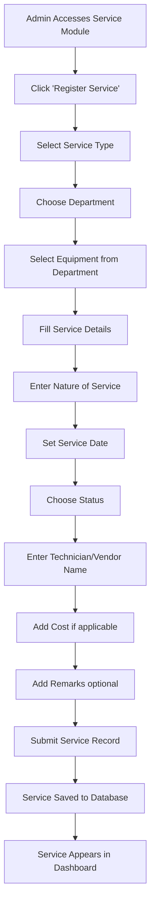

# Service Registration Module Documentation

## Overview

The **Service Registration Module** is an integral component of the StockNexus Lab Inventory Stock Management System. This module allows administrators to register, track, and manage all equipment maintenance, repair, calibration, and installation services performed on laboratory equipment.

---

## Purpose

The Service Registration Module serves several critical functions:

1. **Centralized Service Tracking**: Maintain a complete history of all equipment services in one location
2. **Service Type Classification**: Distinguish between internal (in-house) and external (third-party vendor) services
3. **Status Monitoring**: Track the progress of services from pending to completion
4. **Cost Management**: Record and analyze service costs for budgeting and reporting
5. **Equipment Lifecycle Management**: Link services to specific equipment to maintain complete maintenance histories
6. **Accountability**: Record technician/vendor names and service details for accountability

---

## Access Control

### Admin-Only Access

**CRITICAL**: The Service Registration Module is **exclusively accessible to users with the Admin role**.

#### Why Admin-Only?

- **Data Integrity**: Prevents unauthorized modifications to service records
- **Financial Control**: Service costs are sensitive financial information
- **Quality Assurance**: Ensures only authorized personnel can register and manage services
- **Audit Trail**: Maintains accountability for all service-related activities

#### Security Implementation

Access control is enforced through:

1. **Row Level Security (RLS) Policies** on the `services` table:
   - Only authenticated users with `admin` role can view services
   - Only authenticated users with `admin` role can insert services
   - Only authenticated users with `admin` role can update services
   - Only authenticated users with `admin` role can delete services

2. **UI Navigation**: The Service Registration link only appears in the sidebar for admin users

3. **Database-Level Enforcement**: All database operations verify admin status through the `has_role()` function

---

## Service Types

### 1. Internal Service
Services performed by college staff or in-house maintenance teams.

**Use Cases:**
- Routine maintenance by college technicians
- In-house calibration services
- Installation by college IT department
- Minor repairs by departmental staff

**Benefits:**
- Lower cost
- Faster turnaround
- Better equipment familiarity
- Institutional knowledge retention

### 2. External Service
Services performed by outside vendors or third-party providers.

**Use Cases:**
- Specialized repairs requiring manufacturer expertise
- Complex calibrations requiring certified technicians
- Warranty-covered services
- Major equipment installations

**Benefits:**
- Access to specialized expertise
- Manufacturer-authorized service
- Warranty compliance
- Advanced diagnostic capabilities

---

## Service Record Fields

Each service record contains the following information:

| Field | Type | Required | Description |
|-------|------|----------|-------------|
| **Service Type** | Enum | Yes | Internal or External |
| **Department** | Enum | Yes | Department where equipment is located |
| **Equipment Name** | Reference | Yes | Links to specific inventory item |
| **Nature of Service** | Enum | Yes | Maintenance, Repair, Calibration, or Installation |
| **Date of Service** | Date | Yes | When the service was/will be performed |
| **Status** | Enum | Yes | Pending, In Progress, or Completed |
| **Technician/Vendor Name** | Text | Yes | Name of person/company performing service |
| **Cost** | Numeric | Optional | Service cost in rupees (₹) |
| **Remarks** | Text | Optional | Additional notes or comments |

### Field Details

#### Nature of Service Options:
- **Maintenance**: Preventive or routine maintenance
- **Repair**: Fixing broken or malfunctioning equipment
- **Calibration**: Adjusting equipment to maintain accuracy
- **Installation**: Setting up new equipment or software

#### Status Workflow:
```
Pending → In Progress → Completed
```

- **Pending**: Service scheduled but not yet started
- **In Progress**: Service currently being performed
- **Completed**: Service finished and equipment operational

---

## Workflow

### How Admin Registers a Service



### Step-by-Step Registration Process

1. **Navigate to Service Module**
   - Admin logs into StockNexus
   - Clicks "Service Registration" in Administration section

2. **Initiate New Service**
   - Click "Register Service" button
   - System displays service registration form

3. **Fill Service Information**
   - Select service type (Internal/External)
   - Choose department
   - Select equipment from filtered list
   - Pick nature of service
   - Set service date
   - Choose initial status
   - Enter technician/vendor name
   - Add cost (if known)
   - Include any remarks

4. **Submit & Validation**
   - System validates all required fields
   - Ensures date is valid
   - Verifies cost is numeric (if provided)
   - Creates service record in database

5. **View & Manage**
   - Service appears in services dashboard
   - Admin can filter by type and status
   - Can view, edit, or delete service records

---

## Key Features

### 1. Service Dashboard

**Analytics Cards:**
- Total Services count
- Internal Services count
- External Services count
- Completed Services count

**Filter Options:**
- Filter by Service Type (All/Internal/External)
- Filter by Status (All/Pending/In Progress/Completed)

**Service Table:**
- Displays all services matching selected filters
- Shows: Equipment, Type, Nature, Department, Date, Status, Technician/Vendor, Cost
- Click "View" to see detailed service information

### 2. Service Registration Form

**Features:**
- Cascading dropdowns (Department → Equipment)
- Date picker for service date
- Form validation with error messages
- Optional fields clearly marked
- Cancel button to abort registration

**Validation Rules:**
- All required fields must be filled
- Service date must be a valid date
- Cost must be numeric (if provided)
- Technician/Vendor name max 200 characters

### 3. Service Detail View

**Information Sections:**
- Service Information card
- Equipment Details card
- Remarks section (if remarks exist)

**Available Actions:**
- Edit service details
- Update service status
- Delete service record (with confirmation)

### 4. Service Editing

**Editable Fields:**
- Service type
- Nature of service
- Service date
- Status
- Technician/Vendor name
- Cost
- Remarks

**Non-Editable Fields:**
- Department (linked to equipment)
- Equipment (to maintain data integrity)

### 5. Service Analytics

**Metrics Provided:**
- Total service count
- Breakdown by internal vs external
- Completion statistics
- Quick visual overview of service activity

---

## Database Schema

### Services Table Structure

```sql
CREATE TABLE public.services (
  id uuid PRIMARY KEY DEFAULT gen_random_uuid(),
  service_type service_type NOT NULL,
  department department NOT NULL,
  equipment_id uuid REFERENCES inventory_items(id) NOT NULL,
  nature_of_service nature_of_service NOT NULL,
  service_date date NOT NULL,
  status service_status DEFAULT 'pending' NOT NULL,
  technician_vendor_name text NOT NULL,
  cost numeric(10, 2),
  remarks text,
  created_by uuid REFERENCES auth.users(id),
  created_at timestamp DEFAULT now() NOT NULL,
  updated_at timestamp DEFAULT now() NOT NULL
);
```

### Custom Enum Types

```sql
-- Service type enum
CREATE TYPE service_type AS ENUM ('internal', 'external');

-- Nature of service enum
CREATE TYPE nature_of_service AS ENUM (
  'maintenance',
  'repair', 
  'calibration',
  'installation'
);

-- Service status enum
CREATE TYPE service_status AS ENUM (
  'pending',
  'in_progress',
  'completed'
);
```

### Row Level Security Policies

```sql
-- Admin can view all services
CREATE POLICY "Admins can view all services"
ON public.services FOR SELECT
TO authenticated
USING (has_role(auth.uid(), 'admin'::app_role));

-- Admin can insert services
CREATE POLICY "Admins can insert services"
ON public.services FOR INSERT
TO authenticated
WITH CHECK (has_role(auth.uid(), 'admin'::app_role));

-- Admin can update services
CREATE POLICY "Admins can update services"
ON public.services FOR UPDATE
TO authenticated
USING (has_role(auth.uid(), 'admin'::app_role));

-- Admin can delete services
CREATE POLICY "Admins can delete services"
ON public.services FOR DELETE
TO authenticated
USING (has_role(auth.uid(), 'admin'::app_role));
```

---

## User Interface Components

### Pages Created

1. **Services.tsx** (`/services`)
   - Main dashboard with analytics and service table
   - Filtering capabilities
   - Navigation to add new services

2. **AddService.tsx** (`/services/add`)
   - Service registration form
   - Form validation
   - Cascading department/equipment selection

3. **ServiceDetail.tsx** (`/services/:id`)
   - Detailed service information display
   - Edit mode functionality
   - Delete service capability

### Navigation

**Sidebar Link:**
- Located in "Administration" section
- Only visible to admin users
- Icon: Wrench tool icon
- Label: "Service Registration"

**Routes:**
```typescript
/services           // Main services dashboard
/services/add       // Register new service
/services/:id       // View/edit specific service
```

---

## Design Consistency

The Service Registration Module follows the existing StockNexus design system:

**UI Elements:**
- Uses shadcn/ui components (Card, Table, Form, Button, Badge)
- Consistent color scheme and typography
- Responsive design for all screen sizes
- DashboardLayout wrapper for consistent page structure

**Styling:**
- Semantic color tokens from design system
- Status badges with appropriate variants
- Consistent spacing and padding
- Mobile-friendly responsive grids

---

## Benefits & Use Cases

### For College Administration

1. **Budget Planning**: Track service costs for budget allocation
2. **Vendor Management**: Maintain list of service providers
3. **Compliance**: Document required maintenance and calibrations
4. **Asset Management**: Complete equipment lifecycle tracking

### For Department Heads

1. **Equipment Reliability**: Monitor service frequency
2. **Downtime Analysis**: Track equipment availability
3. **Cost Attribution**: Department-specific service costs
4. **Service Quality**: Evaluate technician/vendor performance

### For Maintenance Teams

1. **Work Orders**: Track pending and in-progress services
2. **Service History**: View complete maintenance records
3. **Schedule Planning**: Plan preventive maintenance
4. **Documentation**: Record all service activities

---

## Future Enhancements

Potential improvements for future versions:

1. **Service Scheduling**: Calendar integration for service planning
2. **Email Notifications**: Alert relevant staff about service status
3. **Service Reports**: Generate detailed service analytics reports
4. **Vendor Management**: Dedicated vendor database with ratings
5. **Cost Analysis**: Advanced cost tracking and comparison
6. **Preventive Maintenance**: Automated service reminders
7. **Mobile Access**: Mobile app for technicians
8. **File Attachments**: Upload service reports and invoices

---

## Troubleshooting

### Common Issues

**Issue**: Cannot see Service Registration in sidebar
**Solution**: Ensure you are logged in as an admin user

**Issue**: "Permission denied" when accessing services
**Solution**: Contact system administrator to verify admin role assignment

**Issue**: Equipment dropdown is empty
**Solution**: First select a department - equipment list filters by department

**Issue**: Cannot submit service form
**Solution**: Check all required fields are filled with valid data

---

## Technical Support

For technical issues or questions about the Service Registration Module:

1. Check this documentation first
2. Verify admin access and permissions
3. Review console logs for error messages
4. Contact system administrator
5. Submit support ticket with error details

---

## Summary

The Service Registration Module provides comprehensive service tracking capabilities for the StockNexus system, enabling administrators to:

✅ Register and track all equipment services
✅ Distinguish between internal and external services  
✅ Monitor service status and costs
✅ Maintain complete equipment service histories
✅ Generate service analytics and insights
✅ Ensure accountability and documentation

With robust access controls, intuitive interface, and comprehensive data tracking, this module enhances the overall equipment management capabilities of StockNexus.

---

**Module Version**: 1.0  
**Last Updated**: October 2025  
**Maintained by**: StockNexus Development Team
